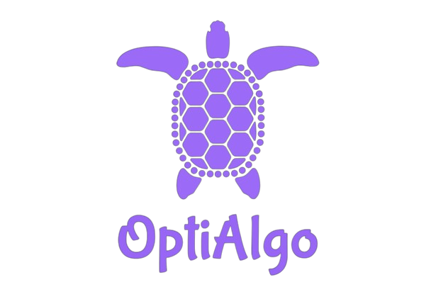

# OptiAlgo (Sedang Dalam Pengembangan)

OptiAlgo adalah sebuah proyek yang masih dalam tahap pengembangan. Proyek ini bertujuan untuk menyediakan solusi yang cepat dan andal bagi pengguna yang ingin menemukan algoritma terbaik untuk data mereka tanpa harus melakukan pengujian yang rumit dan memakan waktu secara manual. Dengan OptiAlgo, pengguna dapat dengan mudah mencari algoritma yang paling sesuai dengan kebutuhan mereka, memberikan fleksibilitas yang diperlukan untuk menangani berbagai jenis masalah data dengan efisien.

## Fitur Utama

...

## Cara Menggunakan

...

## Cara Berkontribusi
Kami sangat menyambut kontribusi dari komunitas untuk meningkatkan dan mengembangkan OptiAlgo. Berikut adalah langkah-langkah umum untuk berkontribusi:

1. **Beri Masukan**: Berikan masukan tentang bagaimana kami dapat meningkatkan OptiAlgo melalui pembuatan *issues*.
2. **Kode Sumber**: Jika Anda seorang pengembang, Anda dapat berkontribusi dengan menulis kode sumber baru atau memperbaiki yang sudah ada.
3. **Uji Coba**: Bantu kami dengan menguji OptiAlgo dan memberikan umpan balik tentang pengalaman Anda.

## Lisensi

...

## Kontak

...

Terima kasih telah menggunakan OptiAlgo!
