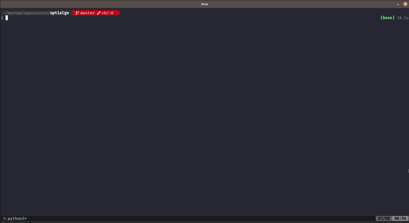

# OptiAlgo
OptiAlgo menyediakan solusi yang cepat dan andal bagi pengguna yang ingin menemukan algoritma terbaik untuk data mereka tanpa harus melakukan pengujian yang rumit dan memakan waktu secara manual.



## Fitur Utama
1. Mencari Algoritma Terbaik
2. Set Model
3. Prediksi
4. Tuning HyperParameter
5. Preprocessing Data (Handling Missing Values,Sampling)

## Instalasi

**Sebelum install OptiAlgo, pastikan Anda telah membuat environment terlebih dahulu.**

```bash
pip install optialgo
```

## Cara Menggunakan
```py
import pandas as pd
from optialgo import Classification

df = pd.read_csv('dataset_ex/drug200.csv')
features = ['Age','Sex','BP','Cholesterol',"Na_to_K"]
target = 'Drug'

clf = Classification()
clf.fit(data=df,target=target,features=features)
result = clf.compare_model(output='dataframe')
print(result)
```
untuk lebih lengkap nya anda bisa temukan pada notebook [example](https://github.com/nsandarma/OptiAlgo/blob/master/example.ipynb)


## Cara Berkontribusi
Kami sangat menyambut kontribusi dari komunitas untuk meningkatkan dan mengembangkan OptiAlgo. Berikut adalah langkah-langkah umum untuk berkontribusi:

1. **Beri Masukan**: Berikan masukan tentang bagaimana kami dapat meningkatkan OptiAlgo melalui pembuatan *issues*.
2. **Kode Sumber**: Jika Anda seorang pengembang, Anda dapat berkontribusi dengan menulis kode sumber baru atau memperbaiki yang sudah ada.
3. **Uji Coba**: Bantu kami dengan menguji OptiAlgo dan memberikan umpan balik tentang pengalaman Anda.

## Lisensi

MIT

## Kontak

email : nsandarma@gmail.com

Terima kasih telah menggunakan OptiAlgo!
